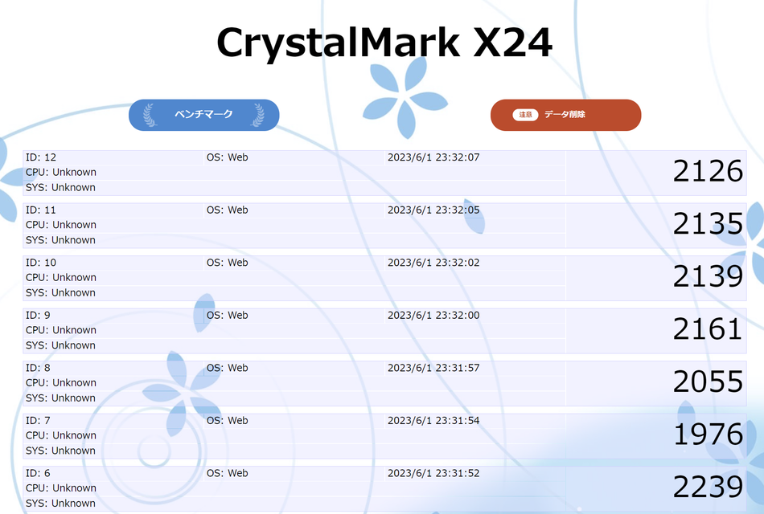

# 課題03 LocalStorage

 

## ①課題内容（どんな作品か）
- CrystalMark X24 ローカルストレージ活用超簡易Web版

## ②工夫した点・こだわった点
- とてつもなく簡易なベンチマークコードをJavaScriptで書き、そのスコア（実行時間）などをローカルストレージに保存しました。
- ベンチマークスコアに加えて、実行日時、実行プラットフォーム情報を保存するため、JSON形式を活用しました。

## ③難しかった点・次回トライしたいこと(又は機能)
- Web版では取得することができないため、CPUなどのシステム情報はいったんUnknownとしました。
- 今後、ネイティブクライアントを作り、サーバーと通信してベンチマーク結果を保存する仕組みを作ります。

## ④質問・疑問・感想、シェアしたいこと等なんでも
- [CSS Stock](https://pote-chil.com/html-maker) がとても便利でボタンのデザインに活用しました。
